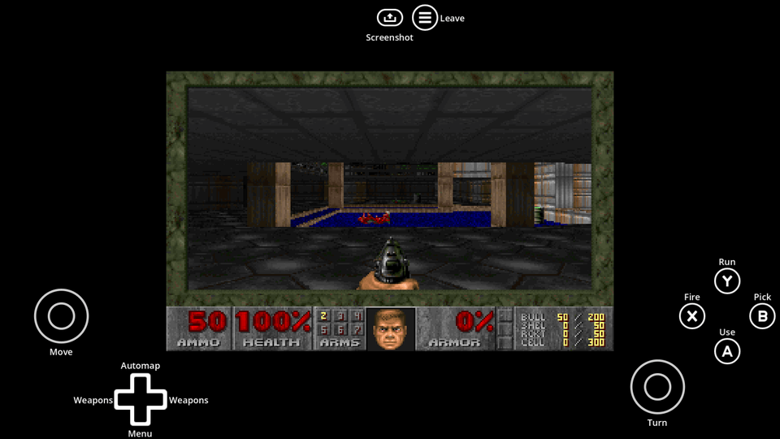

# Godot Doom GDExtension

A GDExtension that runs the real DOOM engine inside Godot 4.8 and shows it on a `TextureRect`. The engine
is [PureDOOM](https://github.com/Daivuk/PureDOOM), a single-header C port of the 1993 source with no OS
layer of its own; this addon supplies its time, file, print and environment callbacks, copies its 320x200
frame into an `ImageTexture` every tick, feeds its 11025 Hz sound into an `AudioStreamGenerator`, and turns
Godot input events into DOOM key, button and mouse events. Everything runs in-process, so the same source
builds for the Windows desktop and for the browser as a WebAssembly side module.

## Demo scene

`scenes/demo/demo.tscn` runs the node full screen with the controls HUD around it and, when Godot MIDI
Player (`addons/midi/`) is in the project, the music through
`assets/gzdoom.sf2`. It is the main scene of the
[Godot Doom GDExtension](https://github.com/kirbycope/godot-doom-gdextension) project this addon is developed
in, and it is also the shortest example of wiring the node up: instantiate it, connect `exited`, connect
`midi_message` to a synthesiser, call `start()`. Where the library is not built for the platform the demo
shows a message instead of failing.

It also shows the two things a host scene has to handle itself. DOOM turns on relative mouse motion, so the
demo captures the cursor in `_ready()`, gives it back on Escape and takes it again on a click. And because a
browser only grants pointer lock from inside a user gesture, a web export cannot capture at startup at all;
the demo puts a "Click to start" `CanvasLayer` up when `OS.has_feature("web")` and captures on that first
click. Off the web the interstitial stays hidden. On a touchscreen it captures nothing: there is no relative
motion to read, and holding the pointer would make the browser's emulated mouse events look like a mouse.

## Playing the demo

The demo runs in a browser at <https://timothycope.com/godot-doom-gdextension/>. A GitHub Action exports it on every
push to `main` and hands it straight to Pages, so the export itself is never committed: the projects that use this
addon fetch it with a script, and a web export is tens of megabytes that git cannot compress.

This repository **is** that project. It uses the layout the
[Godot Asset Library](https://docs.godotengine.org/en/stable/community/asset_library/submitting_to_assetlib.html) expects, with the addon at `addons/godot_doom_gdextension/` and a
`project.godot` at the root, so cloning it and opening it in Godot is all it takes. The
addon is mounted at `res://addons/godot_doom_gdextension/` exactly as it is in a game, so it is
edited in place with nothing copied first, and the root `project.godot` is skipped as a
conflict when the asset is installed from the library.


---

## Using the node

Add a `PureDoom` node (it is a `TextureRect`) anywhere a `Control` can go, typically inside a `SubViewport`
whose texture ends up on a screen mesh. Then:

```gdscript
var doom: Control = ClassDB.instantiate(&"PureDoom")
add_child(doom)
doom.call(&"start") # Boots the shareware WAD straight into E1M1
doom.call(&"stop")  # Freezes the game where it is; start() resumes it
```

`ClassDB.class_exists(&"PureDoom")` tells you whether the library is built for the running platform, so a
scene can fall back to something else where it is not (the demo world falls back to a GDScript raycaster).

| Property | Meaning |
| --- | --- |
| `wad_path` | The IWAD to load; defaults to the shareware `assets/doom1.wad`. A registered `doom.wad` works too. |
| `mouse_sensitivity` | Mouse pixels to DOOM turn units. |
| `skill` | 1 to 5, the `-skill` the level starts on. |

The `exited` signal fires with DOOM's exit code if the engine quits or errors. The `midi_message` signal
carries the music: DOOM's sequencer runs at 140 Hz and every message comes out as an `InputEventMIDI`,
ready for a synthesiser. With [Godot MIDI Player](https://bitbucket.org/arlez80/godot-midi-player-g4) and a
SoundFont that is one line:

```gdscript
doom.midi_message.connect(midi_player.receive_raw_midi_message)
```

On a web export that line is not quite enough. Godot defaults `audio/general/default_playback_type.web` to
`Sample`, which hands an `AudioStreamWAV` straight to WebAudio and skips the bus chain and the per-note
volume a software synthesiser writes every frame, so the music plays silently while DOOM's own sound, an
`AudioStreamGenerator` that cannot be sampled, still comes through. Put the synthesiser's voices back on
stream playback after it is in the tree, as `scenes/demo/demo.gd` does:

```gdscript
for player: AudioStreamPlayer in midi_player.audio_stream_players:
	player.playback_type = AudioServer.PLAYBACK_TYPE_STREAM
	player.get_node(^"Linked").playback_type = AudioServer.PLAYBACK_TYPE_STREAM
```

Setting `audio/general/default_playback_type.web` to `Stream` in the project settings does the same thing for
every `AudioStreamWAV` in the project at once; this project sets both.

Controls: WASD walks and strafes, the mouse turns, left click and Ctrl fire, Space uses, Shift runs, Tab is
the automap, 1 to 7 pick weapons, backquote (`) opens DOOM's menu (Enter picks, backquote closes), and the
letters stay themselves so the cheat codes can be typed. On a pad the left stick walks and strafes, the right
stick turns (it presses DOOM's left and right arrows, so Y for run applies), RT and X fire, A uses, Y runs,
B accepts, Back opens the menu, and the d-pad is context-sensitive: with the menu up it is the arrow keys,
in the game up is the automap and down is the menu. Left and right cycle weapons, which the engine leaves to
the host: DOOM has no previous-or-next weapon key at all, only the seven numbers, so `get_weapon_slot()` says
what is in hand, `is_weapon_owned(slot)` says what is being carried, and the host walks to the next owned slot
and presses that number. The HUD below does exactly that.
On a touchscreen the HUD's own buttons drive that same pad mapping, so the browser demo plays on a phone.
`is_menu_open()`, `is_automap_open()`, `get_weapon_slot()` and `is_weapon_owned()` expose the same engine state. The level starts directly (`-warp 1 1`)
because Escape and Start are left to the host scene; after dying, use restarts the level.

## The controls HUD

`scenes/pure_doom_controls.tscn` is the on-screen mapping: the
[controls](https://github.com/kirbycope/godot-controls) addon's `controls.tscn` inherited, with a `doom_*`
action on every slot DOOM has a use for and each button named after what the engine does with it. The scene
is the mapping rather than a picture of one, so the actions and the words are inspector fields and can be
read by opening it. `resources/pure_doom_inputs.tres` lists the actions the engine publishes, which turns
each slot into a picker of them instead of free text.

The labels say what a button does and never change with the device; only the art on it does. So Fire is Fire
on X, on Square and on Ctrl, which is why the demo no longer prints a separate text card for a keyboard and
a pad. The keyboard art names the keys `pure_doom.cpp` itself answers to: Space uses, Enter picks, Ctrl
fires, Shift runs, Tab is the automap and backquote opens DOOM's menu. The two weapon arms are the exception:
they carry `[` and `]`, the keys an FPS has cycled weapons on since Quake, and they are this HUD's own rather
than DOOM's, because DOOM has no previous-or-next weapon key to name. Every key here is registered on the
same action as the button it sits under, so a button lights up for its key as well as for its pad button.

Changing weapon is the one control with logic behind it. Pressing a number DOOM has no weapon for does
nothing, so the HUD asks the engine what is in hand, walks to the next slot `is_weapon_owned` agrees with,
and presses that slot's number - a real key event, the same one a player typing 4 would make, held for 80 ms
because DOOM reads its input once per tic. It is marked `DEVICE_ID_EMULATION` so the HUD does not mistake its
own keystroke for someone reaching for the keyboard and take a pad player's artwork away. Set the HUD's
`game` to the `PureDoom` node to turn it on; left unset, the arms do nothing.

Slots DOOM does nothing with - the shoulders, the triggers - are left blank, and the addon hides a blank
slot. Back is left blank too even though the engine reads it, because the d-pad's down arm already opens
DOOM's menu and one menu button is enough. Start is the host's rather than the engine's: it is `doom_leave`,
which gives the cursor back. The share button is left to the addon, which puts its own screenshot on it. The
vertical half of the right stick is filled even though the engine ignores it, because the addon hides a
stick whose vertical pair is blank and turning is what that stick is for.

`scripts/pure_doom_controls.gd` holds only the two things the addon leaves to a game. The keys above, and
turning a tap back into the joypad event `pure_doom.cpp` already reads - the engine's pad mapping is the
whole implementation, so a virtual pad needs no new engine code. Buttons and sticks are read differently on
purpose: a `TouchScreenButton` sends an `InputEventAction`, so the buttons are listened for in `_input`, and
nothing else in Godot sends one. Godot's `VirtualJoystick` presses its actions straight into the input state
without sending an event, so the sticks are read in `_process` instead, and only on a touchscreen - a key or
a real pad reaches `PureDoom` on its own, and the keys above are bound to those same actions, so counting
them would hand DOOM a W it already had.

The addon is a dependency rather than an option: `tools/addons.json` names it and `python tools/pull_addons.py`
fetches it, which is what the CI workflows run before anything else.

Config and save files go to `user://pure_doom/`. PureDOOM keeps one global engine, so only one `PureDoom`
node can run in a process and it initialises once; `stop()` and `start()` pause and resume it.

## Building

Prebuilt binaries for Windows, macOS and the web are in `bin/`. To rebuild, clone godot-cpp into this folder (it is git-ignored) and dump
the extension API from the Godot build you run, so the bindings match it:

```powershell
git clone --depth 1 https://github.com/godotengine/godot-cpp.git godot-cpp
& 'C:\Godot\godot.exe' --headless --dump-extension-api      # writes extension_api.json
scons platform=windows target=template_debug custom_api_file=extension_api.json
scons platform=windows target=template_release custom_api_file=extension_api.json
scons platform=web threads=no target=template_release custom_api_file=extension_api.json
```

On macOS the same steps with `brew install scons` and the Xcode Command Line Tools produce a universal
(arm64 and x86_64) framework:

```sh
git clone --depth 1 https://github.com/godotengine/godot-cpp.git godot-cpp
/Applications/Godot.app/Contents/MacOS/Godot --headless --dump-extension-api   # writes extension_api.json
scons platform=macos arch=universal target=template_debug custom_api_file=../../extension_api.json
scons platform=macos arch=universal target=template_release custom_api_file=../../extension_api.json
```

Windows needs Visual Studio 2022 with the C++ workload, Python and SCons. The web build needs the
Emscripten SDK on `PATH` (`emsdk_env`), and the Web export preset needs Extension Support on and Thread
Support off to match the `threads=no` library. Godot's `godot-cpp` `master` branch is used because the
project runs a 4.8 development build.

## Credits and licenses

| What | Author | License | Source |
| --- | --- | --- | --- |
| `addons/controls` | Tim Cope | MIT | https://github.com/kirbycope/godot-controls |
| `thirdparty/PureDOOM.h` | Daivuk (David St-Louis), from the id Software DOOM source | GPL 2.0 (`thirdparty/LICENSE`) | https://github.com/Daivuk/PureDOOM |
| `assets/doom1.wad` | id Software | DOOM shareware, freely redistributable | https://github.com/Daivuk/PureDOOM |
| `assets/gzdoom.sf2` (GZDoom's default General MIDI SoundFont, an SC-55 preset) | ZDoom team | not recorded - fill in (ships with GZDoom, no license file of its own) | https://github.com/ZDoom/gzdoom/blob/master/soundfont/gzdoom.sf2 |
| `src/` | this project | MIT | |
